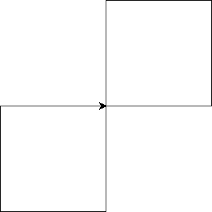

# Python Sample Assessment 2
## Question 1
Write a comment on the first line that reads `In the humble service of King Jakob`

Write the following code:
```python
king = 'jakob'
age = 30
```
Add one line of code to print out the line below.
```
King Jakob is 30 years old.
```
Save as z#######_Q1.py where z####### is your zID.

## Question 2
Write code that prompts the user for the name of the current king. If the user enters `Jakob`, let them know they are correct. If they are wrong, ask them again.
Save as z#######_Q2.py where z####### is your zID.

## Question 3
Create a list of five words that describe King Jakob. Use a `for` loop to display the message below.
```
King Jakob is kind.
King Jakob is benevolent.
King Jakob is just.
King Jakob is wise.
King Jakob is generous.
```
Save as z#######_Q3.py where z####### is your zID.

## Question 4
Write code using a `for` loop that will output the message below.
```
The years King Jakob has been alive:
1990
1991
1992
1993
1994
1995
1996
1997
1998
1999
2000
2001
2002
2003
2004
2005
2006
2007
2008
2009
2010
2011
2012
2013
2014
2015
2016
2017
2018
2019
2020
```
Save as z#######_Q4.py where z####### is your zID.

## Question 5
Write code using a `for` loop that displays the following:
```
1 king and 2 knights is 3 people
1 king and 3 knights is 4 people
1 king and 4 knights is 5 people
1 king and 5 knights is 6 people
1 king and 6 knights is 7 people
1 king and 7 knights is 8 people
```
Save as z#######_Q5.py where z####### is your zID.

## Question 6
Create a function named `create_greeting`, which accepts one argument, the time of day (morning/afternoon/evening/night). The function will create a greeting for the King and return the result. No `print` is allowed in the function.

Create one variable, which is a string. Call the function and pass it the variable. Display the greeting for the King using the variable and result returned from the function.
```
Good evening, King Jakob!
```

Save as z#######_Q6.py where z####### is your zID.

## Question 7
Write code that asks the user if they know the glory of King Jakob. If the user doesn't know the glory of King Jakob, display a message chastising them. Otherwise, the program should ask the user to enter 4 adjectives describing King Jakob. The program should then display a message describing King Jakob with the words they have supplied, using a `for` loop to input each of the words.
```
Do you know the glory of King Jakob y/n? y
Please enter 4 words that describe the glory of King Jakob
Please enter a word: kind
Please enter a word: good
Please enter a word: just
Please enter a word: fair
King Jakob is kind, good, just, and fair
```
Save as z#######_Q7.py where z####### is your zID.

## Question 8
Write code using turtle that draws the following.

The length of the sides of the squares is 150.

Your turtle arrow is not required to end in the same place/direction as shown below.



Save as z#######_Q8.py where z####### is your zID.
