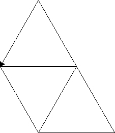

# Python Sample Assessment 3
## Question 1
Write the following code:
```python
name = input('Enter your name: ')
repetitions = input('Enter the number of repetitions: ')
```
Add one line of code to print out the line below, where `[name]`
 represents the inputted name.
 ```
[name] says, "Hail to the King!"
```
Additionally, add a `for` loop to print this statement the inputted number of repetitions.

Save as z#######_Q1.py where z####### is your zID.

## Question 2
Write code that prompts the user with the phrase "Easy peasy…". If they reply "lemon squeezy" (not case sensitive), then ask them for for their name and the name of the King. If the user enters `Jakob`, let them know they are correct and that they can be of good service to the King. If they are wrong, tell them that the king they entered is false and prompt them to enter it again.

```
Easy peasy... no
Easy peasy... lEmOn SqUeEzY
Enter your name: George
Enter the name of the King: Barry
Barry is a false king!
Enter the name of the King: Jakob
George, you can be of good service to King Jakob.
```

Save as z#######_Q2.py where z####### is your zID.

## Question 3
Create a list of four words (no punctuation). Use a `for` loop to display the message below.
```
easy!
peasy!
lemon!
squeezy!
```
Save as z#######_Q3.py where z####### is your zID.

## Question 4
Write code using a `for` loop that will output the message below.
```
King Jakob was...
 1 year  old in 1991
 2 years old in 1992
 3 years old in 1993
 4 years old in 1994
 5 years old in 1995
 6 years old in 1996
 7 years old in 1997
 8 years old in 1998
 9 years old in 1999
10 years old in 2000
11 years old in 2001
12 years old in 2002
13 years old in 2003
14 years old in 2004
15 years old in 2005
16 years old in 2006
17 years old in 2007
18 years old in 2008
19 years old in 2009
20 years old in 2010
21 years old in 2011
22 years old in 2012
23 years old in 2013
24 years old in 2014
25 years old in 2015
26 years old in 2016
27 years old in 2017
28 years old in 2018
29 years old in 2019
```
Save as z#######_Q4.py where z####### is your zID.

## Question 5
Write code using a `for` loop that displays the following:
```
90 / 10 = 9
80 / 10 = 8
70 / 10 = 7
60 / 10 = 6
50 / 10 = 5
40 / 10 = 4
30 / 10 = 3
20 / 10 = 2
10 / 10 = 1
```
Save as z#######_Q5.py where z####### is your zID.

## Question 6
Create a function named `add_squares`, which accepts three arguments. The function adds the squares of the numbers together and returns the result. No `print` is allowed in the function.

Create three variables. Call the function and pass it the variables. Then display the message below, using the variables and the result return from the function
```
4 squared plus 7 squared plus 9 squared equals 146
```

Save as z#######_Q6.py where z####### is your zID.

## Question 7
Write code that asks the user if they have betrayed the King. If the user has betrayed the King, ask for their name. Then display a message telling them the knights are coming for them.
```
Have you betrayed the King y/n? y
Please enter your name: Mary
The knights of the King will find you, Mary.
```
Otherwise, the program should ask the user to enter the names of three people who have betrayed King Jakob (do this with a `for` loop). The program should then display a message telling them the knights are coming for those people.
```
Have you betrayed the King y/n? n
Who has betrayed the King? Todd
Who has betrayed the King? Jill
Who has betrayed the king? Thomas
The knights of the King will find Todd, Jill, and Thomas.
```
Save as z#######_Q7.py where z####### is your zID.

## Question 8
Write code using turtle that draws the following.

The length of the sides of the equilateral triangles is 150.

Your turtle arrow is not required to end in the same place/direction as shown below.



Save as z#######_Q8.py where z####### is your zID.
