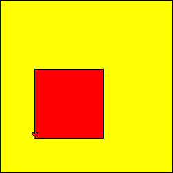

# Python Sample Final Exam 2
## Question 1
Write code, using a loop, to print out the following sequence:
```
100, 90, 80, 70, 60, 50, 40, 30, 20, and 10
```
Your sequence should look the same, including commas, spaces, and "and".

## Question 2

Use Turtle to draw the following shapes:



The sides of the inner square are 100pt. The sides of the outer square are 250pt.

The distances between the left side of the outer square and the left side of the inner square is 50pt. The distance between the bottoms of the squares is also 50pt.


## Question 3
Use the following code which contains the key states in the United States presidential election, the number of electoral votes for the states, and the current number of votes for Biden and Trump in each state.

```python
#    ['state name', electoral votes, Biden votes, Trump votes]
MN = ['Minnesota', 10, 1671129, 1436422]
ME = ['Maine', 4, 327878, 254049]
FL = ['Florida', 29, 5269926, 5646949]
OH = ['Ohio', 18, 2576590, 3038247]
TX = ['Texas', 38, 5145367, 5810522]
NC = ['North Carolina', 15, 2655383, 2732120]
GA = ['Georgia', 16, 2279736, 2381870]
WI = ['Wisconsin', 10, 1420855, 1529223]
AZ = ['Arizona', 11, 1367211, 1236546]
NV = ['Nevada', 6, 553484, 528442]
MI = ['Michigan', 16, 1956696, 2198132]
PA = ['Pennsylvania', 20, 2286865, 2964853]

key_states = [MN, ME, FL, OH, TX, NC, GA, WI, AZ, NV, MI, PA]

print('STATE             ELECTORAL VOTES   BIDEN VOTES   TRUMP VOTES   PROJECTED')
```

Sort the key_states list so that the states and their votes are sorted with the highest electoral votes first and the lowest electoral votes last. Determine whether each state is projected to be a Biden win (Biden votes > Trump votes) or a Trump win (Trump votes > Biden votes).

```
STATE             ELECTORAL VOTES   BIDEN VOTES   TRUMP VOTES   PROJECTED
 North Carolina    15                2655383       2732120       Trump
 Wisconsin         10                1420855       1529223       Trump
```

Note: make sure you maintain data integrity, each state must have their correct votes.

Bonus: At the end, calculate how many electoral votes are projected to go to each presidential candidate.

## Question 4

Write code that asks the user to guess a random number between 1 and 100.
```
Guess a number between 1 and 100: 
```
The user then types their answer.

Check the user's answer.
- If the user does not enter a number, give an appropriate error message.

- If the user enters a number, but it is not between 1 and 100, give a different appropriate error message.

- If the user enters a number, but it is not correct, tell them if the correct number is more or less than that.

- If the user enters the correct number, tell them it was correct.

Repeat the quiz until the user guesses a number correctly, or tries to guesses 5 times, whichever comes first.

Display the number of guesses and wish them luck next time or congratulate them on their win.

You can use this function to generate a random integer between 1 and 100:
```python
import random

random_num = random.randint(1, 100)
```


## Question 5
